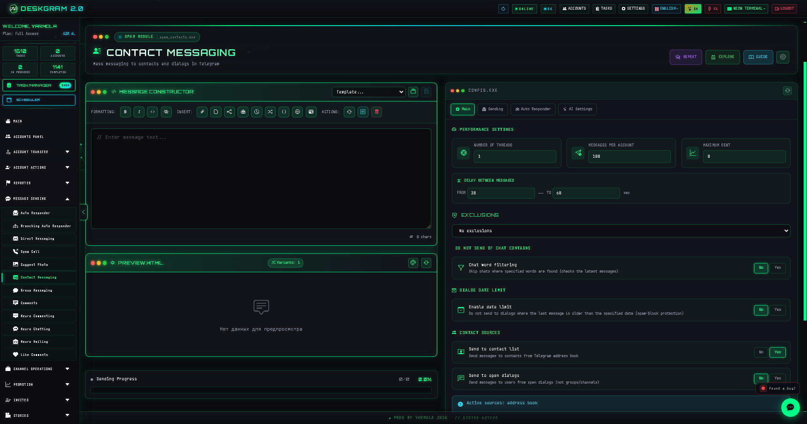
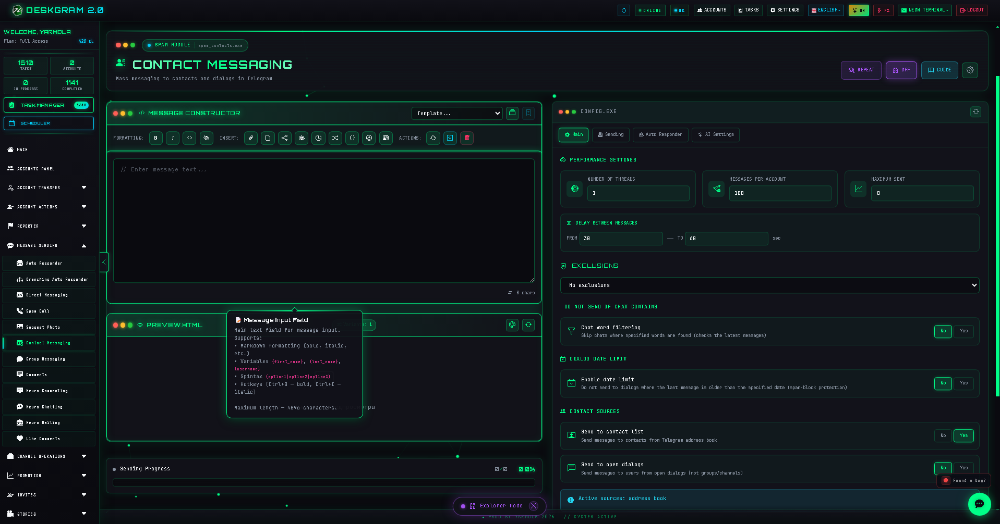
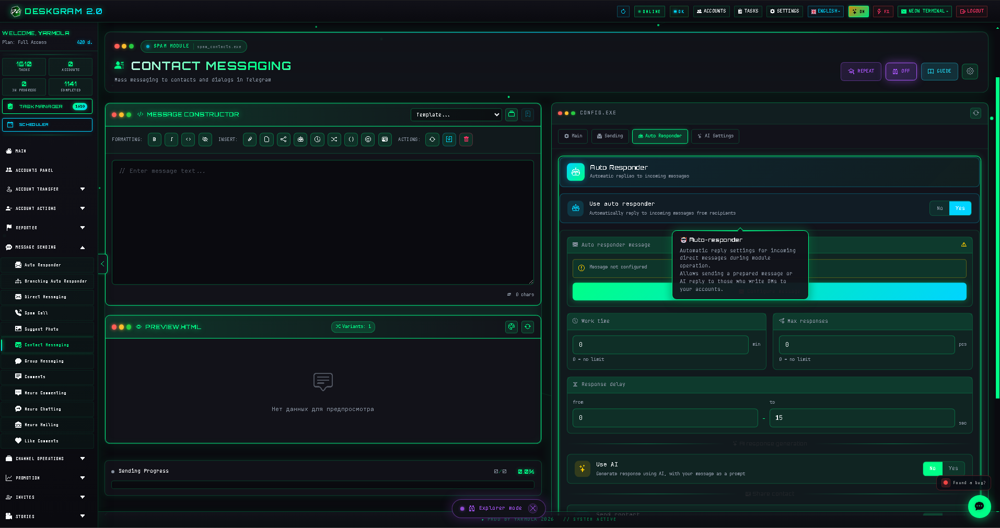
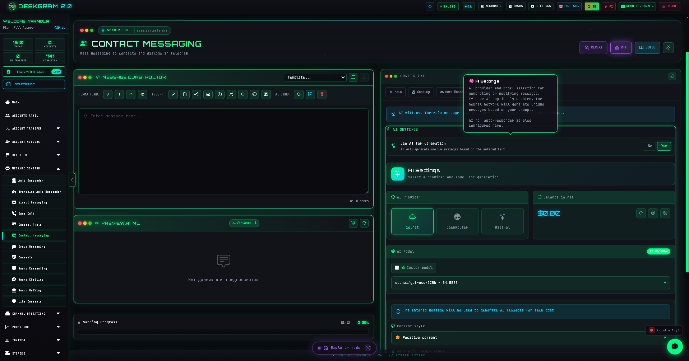

# Telegram Contact Messaging with Deskgram 2

Telegram Contact Messaging in Deskgram 2 helps build a contact-driven communication layer with message construction, progress tracking, logs, send tabs, autoresponder logic, and AI settings in one place.

[Deskgram 2 Hub](https://github.com/Deskgram-2/deskgram-2-telegram-automation-en) · [Website](https://deskgram2.com/) · [Telegram Bot](https://t.me/DG2welcomebot) · [Web Preview](https://deskgram2.com/web-preview?path=%2Fapp-demo%2F&lang=en)

## Interactive Web Preview

Try the module interface in the browser: [Open web preview](https://deskgram2.com/web-preview?path=%2Fapp-demo%2Ffunctions%2Fspam_contacts&lang=en)

## Screenshots

## About the module

| Parameter | What is inside |
|---|---|
| Main task | Sending Telegram messages through a contact-based route |
| Important blocks | Message constructor, progress, logs, send tabs, autoresponder, AI |
| Useful for | Contact-driven communication, repeated touchpoints, CRM-like Telegram flows |
| Related sections | Direct Messaging, Account Manager, Proxy Manager, Settings |

## What it can do

- send messages across a contact base;
- control performance and account-level limits;
- work with delays and sending tabs;
- connect autoresponder and AI options inside the same route;
- keep progress and logs visible in one operational panel.

## Quick start

1. Prepare the message.
2. Load or choose the contact base.
3. Configure performance, limits, and delays.
4. Enable autoresponder or AI tabs when needed.
5. Launch the route and watch the progress panel.

## Related repositories

- [Deskgram 2 Hub](https://github.com/Deskgram-2/deskgram-2-telegram-automation-en)
- [Direct Messaging](https://github.com/Deskgram-2/telegram-direct-messaging-deskgram-en)
- [Account Manager](https://github.com/Deskgram-2/telegram-account-manager-deskgram-en)
- [Proxy Manager](https://github.com/Deskgram-2/telegram-proxy-manager-deskgram-en)
- [Automation Settings](https://github.com/Deskgram-2/telegram-automation-settings-deskgram-en)

## FAQ

### Can I inspect the module before installing anything?

Yes. The browser preview already shows the constructor, progress panel, logs, and the key settings tabs.

### Is this identical to the normal direct messaging module?

Not exactly. This route is focused on a contact-base workflow rather than a broader DM logic.
